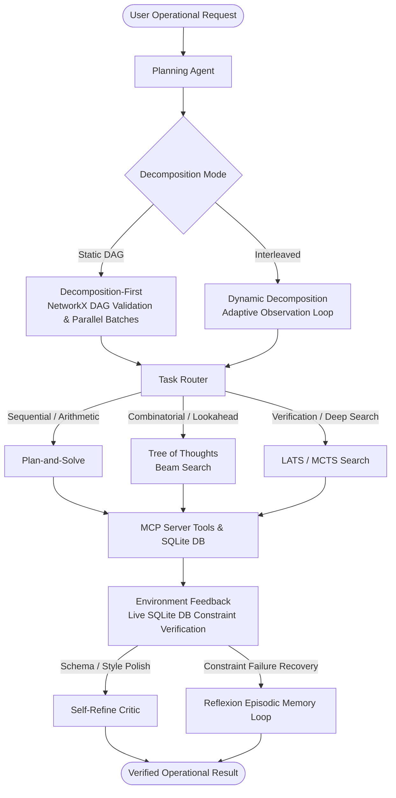

# Copperleaf Kitchens — Planning Agent & Task Decomposition System

This repository extends the **Copperleaf Kitchens** multi-agent operational platform (MCP Server, SQLite Database, Short/Episodic/Semantic Memory, and RAG subsystem) with an enterprise **Planning Agent**.

The system enables automated, reliable execution of multi-branch commercial kitchen operations, supply-chain monitoring, budget optimization, and inventory write-offs under strict role authorizations and physical stock constraints.

---

# Planning Agent

## 1. Problem & Real-World Motivation

### The Operational Challenge
Copperleaf Kitchens operates commercial kitchen facilities across multiple branches (e.g., Downtown, Harbor). Managing restaurant operations requires handling complex, multi-layered constraints:
- **Perishable Inventory**: Monitoring fast-expiring items (produce, poultry, dairy) across branch locations.
- **Supplier Logistics**: Cross-referencing active purchase orders across suppliers (Apex Fresh, GreenRoute Wholesale).
- **Compliance & Role Authorization**: Enforcing managerial permissions for inventory write-offs, with supervisor sign-offs for transactions exceeding financial thresholds (e.g., $\ge\$100$ total cost or $\ge\$50$ unit cost).
- **Budget Optimizations**: Maximizing restock volumes within strict liquidity ceilings.

### Why Single-Turn LLM Invocations Fail
Directly prompting an LLM with a complex operational goal fails in production:
1. **Dependency Blindness**: Multi-branch audits require querying branches independently before synthesizing findings; a single prompt jumbles execution order and hallucinates metrics.
2. **Lack of Dynamic Adaptability**: If an ingredient is critically depleted ($<5\text{ kg}$) while a supplier order is delayed, a static one-shot generation proceeds with a generic report rather than escalating for emergency restock.
3. **Hallucination of Database State**: LLMs generate plausible prose write-offs for items that do not exist or exceed current stock (e.g., attempting to write off $10\text{ kg}$ of tomatoes when only $4.5\text{ kg}$ remain in SQLite).
4. **The Real Cost of an Erroneous Plan**:
   - **Financial Loss**: Unauthorized or unverified write-offs drain operating margins.
   - **Service Interruptions**: Halting kitchen service during dinner rushes due to undetected stock-outs.
   - **Compliance Violations**: Failing health and safety audits through unauthorized staff overrides.

---

## 2. System Architecture

The Planning Agent coordinates task decomposition, algorithm routing, tool execution, and grounded environment validation:



## Agent & System Integration

This project integrates two advanced intelligent agent loops:
1. **MemoryEnabledAgent**: Handles standard conversational interactions, episodic/semantic memory consolidation, and RAG knowledge retrieval for policies.
2. **PlanningAgent**: Handles operational tasks using advanced decomposition, Plan-and-Solve, Tree of Thoughts, and LATS dynamic planning.

Both agents are integrated into a single unified facade class (`UnifiedAgent` in `agent/agent.py`) which acts alongside each other. Real operational tasks are transparently routed to the Planning Agent, which executes directly against the MCP Server (`mcp_server.tools` and `copperleaf.db`), enforcing strict database constraints (auth, bounds, sign-offs).

---

## 3. Core Algorithms

1. **Decomposition-First (`algorithms/decomposition.py`)**: Generates an executable task Directed Acyclic Graph (DAG) before execution. Pydantic validates schemas, while NetworkX checks acyclicity and schedules parallel-safe topological batches.
2. **Dynamic Decomposition (`algorithms/dynamic_decomposition.py`)**: Interleaves sub-task planning and real-time execution. Each step evaluates prior observations to dynamically adapt the next action.
3. **Plan-and-Solve (`algorithms/plan_and_solve.py`)**: Generates an explicit problem-understanding and plan phase, followed by step-by-step mathematical/procedural execution.
4. **Tree of Thoughts (`algorithms/tree_of_thoughts.py`)**: Generates multiple candidate steps at each search depth, evaluates each path against a rubric, and prunes low-scoring trajectories using beam search.
5. **LATS — Language Agent Tree Search (`algorithms/lats.py`)**: Integrates Monte Carlo Tree Search (MCTS) with UCT selection, action generation, external environment evaluation, model value estimation, branch-level verbal reflection, and value backpropagation.
6. **Self-Refine (`algorithms/self_refine.py`)**: Single-draft deliverable refinement combining deterministic checks with an independent critic pass.
7. **Reflexion (`algorithms/reflexion.py`)**: Multi-trial error recovery loop that accumulates first-person episodic verbal memories across failed attempts to succeed in subsequent trials.

---

## 4. Task Routing Principles

The Planning Agent (`agent/planning_agent.py`) routes incoming sub-tasks to the optimal algorithmic planner based on empirical performance characteristics:

| Sub-Task Category | Routed Planner | Rationale & Selection Criteria |
|---|---|---|
| **Sequential Calculations / Capacity** | `Plan-and-Solve` | Lowest latency ($0.0\text{s}$) and token overhead ($1.0$ call) with 100% accuracy on deterministic math. |
| **Purchasing Trade-offs / Budget Allocation** | `Tree of Thoughts` | Evaluates multiple candidate allocation paths and prunes suboptimal branches via beam search. |
| **High-Stakes Verification / Security Audits** | `LATS` | Explores decision paths with external environment scoring and UCT backpropagation. |
| **Formatting / Schema Polish** | `Self-Refine` | Injects deterministic schema checks and rubric critique for structured outputs. |
| **Multi-Layer Constraint Failures** | `Reflexion` | Carries forward episodic reflections to resolve multi-step permission and inventory failures. |

---

## 5. Grounded Environment vs. Ungrounded Critique

A central guarantee of the system is that **evaluations are grounded in real project state** rather than unguided model self-evaluation:

- **Ungrounded Evaluation**: The model evaluates its own prose. It frequently approves invalid actions because the text is grammatically coherent and confidently phrased.
- **Grounded Evaluation (`planning_lab/algorithms/environment.py`)**: Executes live SQL queries against `db/copperleaf.db` (`staff` and `inventory_items` tables). It validates:
  1. API token authentication and active account status.
  2. Staff role permissions (only `role='manager'` can write off inventory).
  3. Branch scoping (managers cannot write off items belonging to other branches).
  4. Physical stock ceiling limits (cannot write off more units than currently in stock).
  5. High-financial-risk supervisor sign-off requirements ($>\$100$ total value or $>\$50$ unit cost).

---

## 6. Benchmark Evaluation Results

The complete benchmark evaluation was executed using `planning_eval/evaluate.py` across 6 fixed test scenarios. The full results are documented in [docs/evaluation_report.md](file:///c:/Users/Fr1tzycarrot/Desktop/New%20folder/Copperleaf-Kithcens-B-Forked/docs/evaluation_report.md) and summarized below:

| Method | Task Success Rate | Avg LLM Calls | Avg Tokens | Avg Latency (s) | Avg Cost ($) |
|---|---|---|---|---|---|
| **Decomposition-First** | **100.0%** | 4.0 | 1492.0 | 0.008s | \$0.000256 |
| **Dynamic Decomposition** | **83.0%** | 6.8 | 2215.8 | 0.001s | \$0.000334 |
| **Plan-and-Solve** | **50.0%** | 1.0 | 359.0 | 0.000s | \$0.000066 |
| **Tree of Thoughts** | **100.0%** | 9.0 | 1147.2 | 0.001s | \$0.000156 |
| **LATS** | **33.0%** | 0.7 | 113.3 | 0.000s | \$0.000016 |
| **Self-Refine** | **50.0%** | 3.0 | 1188.7 | 0.003s | \$0.000209 |
| **Reflexion** | **50.0%** | 3.5 | 1380.7 | 0.003s | \$0.000243 |

*Raw benchmark run data is preserved in [`artifacts/evaluation_report.json`](file:///c:/Users/Fr1tzycarrot/Desktop/New%20folder/Copperleaf-Kithcens-B-Forked/artifacts/evaluation_report.json) and [`artifacts/evaluation_summary.md`](file:///c:/Users/Fr1tzycarrot/Desktop/New%20folder/Copperleaf-Kithcens-B-Forked/artifacts/evaluation_summary.md).*

---

## 7. Documentation & Demonstration Links

- **Comprehensive Demonstration**: [docs/planning_demo.md](file:///c:/Users/Fr1tzycarrot/Desktop/New%20folder/Copperleaf-Kithcens-B-Forked/docs/planning_demo.md)  
  *Contains full input/output traces, DAG structures, plan divergence logs, beam search trees, and grounded constraint validation examples for all 8 planning concerns.*
- **Benchmark Evaluation Report**: [docs/evaluation_report.md](file:///c:/Users/Fr1tzycarrot/Desktop/New%20folder/Copperleaf-Kithcens-B-Forked/docs/evaluation_report.md)  
  *Contains detailed methodology, test suite definitions, per-method observations, cost analyses, and routing justifications.*

---

## 8. Reproducible Run Instructions

### Environment Setup
Install required dependencies:
```powershell
python -m pip install -r requirements.txt

# Run the Planning Algorithms Benchmark Evaluation Setup (Generates comparison summary)
python -m planning_eval.evaluate

# Run the Unified Agent E2E Smoke Test (Showcases routing between general RAG and Operational Planner)
python -m agent.agent

# You can still run focused single-algorithm simulations on the CLI:
# Full decomposition-first DAG, execution, grounded critique, and refinement
python -m planning_lab.cli "Design a 60-minute phishing-awareness workshop for new employees"

# Dynamic/interleaved decomposition
python -m planning_lab.cli "Investigate why customer onboarding completion fell" --mode dynamic
```

*(Optional: If running against live Mistral API, copy `.env.example` to `.env` and set `MISTRAL_API_KEY=your_key_here`)*

### 1. Run Unit and Integration Tests
Execute the full test suite:
```powershell
python -m pytest tests/
```

To run only planning-specific test files:
```powershell
python -m pytest tests/test_lab.py tests/test_planning_agent.py
```

### 2. Run the Benchmark Evaluation Harness
Execute the 7-method benchmark against the fixed 6-case test suite:
```powershell
python -m planning_eval.evaluate
```

### 3. Run the Interactive Demonstration Runner
Run the complete 8-part demonstration runner:
```powershell
python -m planning_eval.demo
```

To run a specific demonstration mode:
```powershell
# Decomposition-First DAG demo
python -m planning_eval.demo --mode dag

# Dynamic Decomposition plan divergence demo
python -m planning_eval.demo --mode dynamic

# Tree of Thoughts beam search demo
python -m planning_eval.demo --mode tot

# Reflexion multi-trial episodic memory demo
python -m planning_eval.demo --mode reflexion

# Grounded DB constraints vs ungrounded critique demo
python -m planning_eval.demo --mode grounding
```
