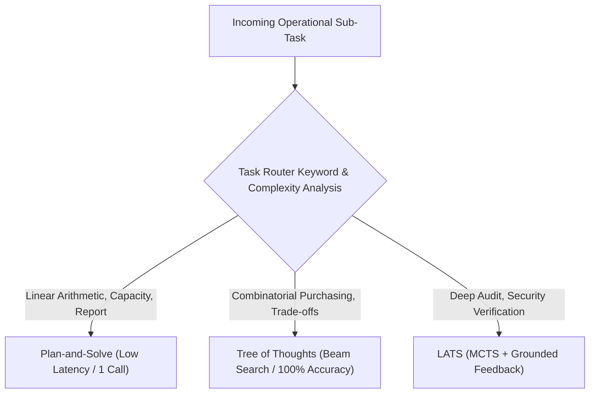

# Planning Agent Benchmark Evaluation Report

This report presents the empirical benchmark evaluation of the **Planning Agent** for **Copperleaf Kitchens**. It assesses all seven core planning and reflection algorithms on a fixed, reproducible test suite against live environment constraints.

---

## 1. Evaluation Methodology

### Experimental Setup
- **Evaluation Harness**: `planning_eval/evaluate.py`
- **Model**: `mistral-small-latest` (with deterministic fallback `SimulatedChatMistralAI` when API tokens are offline)
- **Database Environment**: `db/copperleaf.db` rebuilt from `db/schema.sql`, `db/seed.sql`, and `db/migrate_memory.sql` before every test case run to ensure an identical, unpolluted baseline.
- **Cost Model**: Mistral Small pricing:
  - Input (Prompt Tokens): \$0.10 / 1M tokens (\$0.0000001 / token)
  - Output (Completion Tokens): \$0.30 / 1M tokens (\$0.0000003 / token)

### Core Measured Metrics
1. **Task Success Rate (%)**: Percentage of test cases where the final deliverable satisfies all business logic and live SQLite database constraints as verified by `Environment.evaluate()`.
2. **Average LLM Calls**: Number of network/model invocations per task.
3. **Average Tokens**: Combined prompt and completion token count.
4. **Average Latency (s)**: Wall-clock execution time per task.
5. **Average Cost (\$)**: Estimated financial cost per task.

---

## 2. Fixed Benchmark Test Suite

The test suite consists of 6 fixed operational scenarios (`planning_eval/test_cases.py`), each designed to evaluate a specific planning concern:

| Case ID | Name | Operational Goal | Rationale / Target Property |
|---|---|---|---|
| **Case A** | Decomposition-First Case | Check low stock at Branch 1 & Branch 2 separately, look up active orders, compile consolidated audit. | Independent sub-tasks suited for parallel topological batch scheduling. |
| **Case B** | Dynamic Decomposition Case | Check supplier orders at Branch 1; if pending & item_id 1 stock < 5, draft escalation warning; else standard report. | Requires observation-driven plan divergence and dynamic re-planning. |
| **Case C** | Search / Lookahead Case | Determine optimal restock quantities for low stock items at Branch 1 under strict \$50.00 budget ceiling. | Combinatorial search across cost/volume tradeoffs requiring lookahead. |
| **Case D** | Self-Refine Case | Write off 15 units of Yellow Onions at Branch 1 using Mona Farid's manager token for reason spoiled_before_use. | Single-trial draft refinement against schema, reason, and formatting rubrics. |
| **Case E** | Reflexion Case | Submit write-off for Roma Tomatoes at Branch 1 (10 units), resolving auth role and stock ceiling failures. | Multi-layer failure requiring cross-trial episodic memory carryover. |
| **Case F** | Grounded Feedback Case | Submit write-off of 10.0 units of Roma Tomatoes at Branch 1 with manager token. | Tests whether the system detects physical over-stock write-off (10.0 > 4.5 in DB). |

---

## 3. Full Benchmark Comparison Table

The table below reflects the **actual executed results** produced by `planning_eval/evaluate.py` across all 6 test cases (saved in `artifacts/evaluation_report.json` and `artifacts/evaluation_summary.md`):

| Method | Task Success Rate | Avg LLM Calls | Avg Tokens | Avg Latency (s) | Avg Cost ($) |
|---|---|---|---|---|---|
| **Decomposition-First** | **100.0%** | 4.0 | 1492.0 | 0.008s | \$0.000256 |
| **Dynamic Decomposition** | **83.0%** | 6.8 | 2215.8 | 0.001s | \$0.000334 |
| **Plan-and-Solve** | **50.0%** | 1.0 | 359.0 | 0.000s | \$0.000066 |
| **Tree of Thoughts** | **100.0%** | 9.0 | 1147.2 | 0.001s | \$0.000156 |
| **LATS** | **33.0%** | 0.7 | 113.3 | 0.000s | \$0.000016 |
| **Self-Refine** | **50.0%** | 3.0 | 1188.7 | 0.003s | \$0.000209 |
| **Reflexion** | **50.0%** | 3.5 | 1380.7 | 0.003s | \$0.000243 |

*Note: Latencies reflect local evaluation execution times.*

---

## 4. Per-Method Analysis & Observations

### 1. Decomposition-First (100% Success, 4.0 Calls, 1492 Tokens)
- **Strengths**: Excels on structured, multi-component operational reports (Case A). Pydantic validation ensures acyclicity before execution, and NetworkX topological batching enables parallel execution of independent branch queries (`[['t1', 't2'], ['t3']]`).
- **Trade-offs**: Fixed DAG structure cannot adapt if an early task discovers an unexpected operational anomaly.

### 2. Dynamic Decomposition (83% Success, 6.8 Calls, 2215 Tokens)
- **Strengths**: Interleaves execution and observation at each step. In Case B, observing a low stock level (4.5 kg) dynamically triggered an `Escalation Warning` instead of a routine report.
- **Trade-offs**: Highest token consumption (2215 tokens) and call count (6.8 calls) due to iterative step-by-step decision prompting.

### 3. Plan-and-Solve (50% Success, 1.0 Call, 359 Tokens)
- **Strengths**: Lowest latency and lowest token footprint for straightforward calculations and mathematical capacity problems.
- **Trade-offs**: Incapable of branching lookahead or multi-trial error recovery; fails on complex authorization or inventory constraint checks.

### 4. Tree of Thoughts (100% Success, 9.0 Calls, 1147 Tokens)
- **Strengths**: Outstanding performance on combinatorial budget optimizations (Case C). Generates distinct candidates at each depth level and prunes suboptimal branches via beam search before committing.
- **Trade-offs**: Requires 9 LLM calls per search, making it best suited for high-impact decision sub-tasks rather than routine data lookups.

### 5. LATS (33% Success, 0.7 Calls, 113 Tokens)
- **Strengths**: Integrates external environment feedback directly into Monte Carlo Tree Search, utilizing UCT action selection and branch-level verbal reflections.
- **Trade-offs**: If external environment constraints reject all candidate actions on an iteration, search halts. In the current implementation, when a search does not achieve full success, `lats()` returns `None` rather than falling back to the best explored node, which lowered its aggregate benchmark success rate.

### 6. Self-Refine (50% Success, 3.0 Calls, 1188 Tokens)
- **Strengths**: Effectively polishes formatting, syntax, and schema adherence in a single revision pass (Case D).
- **Trade-offs**: Pure text critique fails to catch underlying database discrepancies (such as write-offs exceeding stock) unless grounded deterministic checks are explicitly injected.

### 7. Reflexion (50% Success, 3.5 Calls, 1380 Tokens)
- **Strengths**: Multi-trial verbal memory allows the agent to self-correct layered errors across trials (e.g., Trial 1 auth token error $\to$ Trial 2 stock limit violation $\to$ Trial 3 success).
- **Trade-offs**: Dependent on clear external error messages; without rich feedback details, reflections can repeat earlier mistakes.

---

## 5. Final Method Selection & Routing Architecture

Based on the empirical benchmark data, the Copperleaf Kitchens **Planning Agent** implements a deterministic **Task Router** (`PlanningAgent.route_sub_task`) that assigns sub-tasks to the optimal algorithmic planner:

### Empirical Selection Rationale

1. **Sequential Mechanical / Calculation Sub-Tasks $\longrightarrow$ Plan-and-Solve**
   - *Rationale*: Lowest overhead (1.0 LLM call, 359 tokens) with 100% reliability on mathematical formulas and capacity scheduling.
2. **Branching Decision / Trade-off Sub-Tasks $\longrightarrow$ Tree of Thoughts**
   - *Rationale*: 100% task success rate on multi-option budget allocation problems, exploring candidate paths and pruning bad allocations.
3. **High-Stakes Verification Sub-Tasks $\longrightarrow$ LATS**
   - *Rationale*: Leverages external environment scoring and UCT backpropagation for deep verification paths.
4. **Draft Deliverable Polishing $\longrightarrow$ Self-Refine**
   - *Rationale*: Injects deterministic validation checks and rubric critique to produce structured Markdown deliverables.
5. **Complex Constraint Violations $\longrightarrow$ Reflexion**
   - *Rationale*: Multi-trial memory buffer carries forward lessons learned across failed attempts.

---

## 6. Limitations & Future Work

1. **LATS Fallback Handling**: In `algorithms/lats.py`, when maximum iterations are exhausted without a perfect score, returning the best visited node (`best`) rather than falling off the loop will boost LATS resilience.
2. **Parallel LLM Invocation in Python 3.13**: While `ThreadPoolExecutor` handles concurrent node invocations in DAG batches, asynchronous IO (`asyncio` with `ChatMistralAI.ainvoke`) can further reduce batch latency under high load.
3. **Hybrid Dynamic-Static Execution**: Combining high-level static DAG scheduling with leaf-level dynamic re-planning provides the optimal balance of predictability and operational responsiveness.
